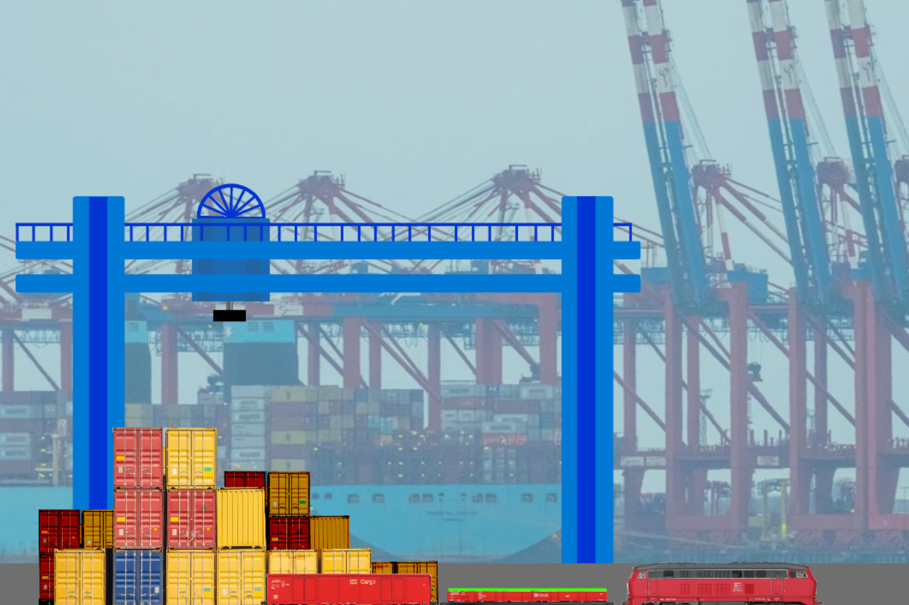

# Hafenkran-Automatisierung

In einem modernen Containerhafen übernimmt ein Portalkransystem die Aufgabe, Schiffscontainer
von der Kaikante auf bereitstehende Güterzüge zu verladen. Der Kran verfügt über drei Bewegungsachsen
(X, Y, Z) sowie einen Greifmechanismus. Bisher wird der Kran manuell über ein Steuerungsterminal
bedient — ein fehleranfälliger und zeitaufwendiger Prozess. Ziel ist es, eine automatisierte
Softwarelösung zu entwickeln, die den Kran eigenständig steuert: Container erkennt, greift,
transportiert und präzise auf den Zielwaggon des Güterzugs absetzt — ohne manuellen Eingriff.

---

## Aufgaben

### 1. Code verstehen und analysieren

Analysiere das bestehende ASP.NET-Projekt sorgfältig.

- Welche Routen sind vorhanden und was macht jede Route?
- Welche Datenstrukturen werden verwendet (`Crane`, `Train`, `TargetContainer`)?
- Wie kommuniziert das GDevelop-Spiel mit dem Server?
- Wie wird der Zustand des Krans gespeichert und abgerufen?

Halte deine Erkenntnisse schriftlich fest.

---

### 2. Recherche: REST-API, GET und POST

Recherchiere was eine REST-API ist und beantworte folgende Fragen:

- Was bedeutet REST und welche Prinzipien stecken dahinter?
- Was ist der Unterschied zwischen einer **GET**-Anfrage und einer **POST**-Anfrage?
- Wie sieht eine HTTP-Anfrage technisch aus (Header, Body, Status-Codes)?
- Welche Tools oder Bibliotheken gibt es in C# um HTTP-Anfragen zu senden (z.B. `HttpClient`)?

---

### 3. Konsolenanwendung schreiben

Schreibe eine eigenständige **C# Konsolenanwendung**, die das Kransystem über die vorhandenen
API-Routen vollautomatisch steuert.

Die Anwendung soll:

- Per **GET** `/api/getAxis`, `/api/getTrainPos` und `/api/getContainerInfo` den aktuellen
  Zustand des Systems abfragen
- Per **POST** `/api/control` den Kran mit Achswerten (`X`, `Y`, `Z`, `Grab`) steuern
- Den Container automatisch greifen und auf den Zielwaggon des Zuges ablegen
- In einer Schleife laufen und den Fortschritt in der Konsole ausgeben

**Wichtig:**

> **Der ASP.NET-Server sowie das Web-UI dürfen nicht verändert werden.**
> Die gesamte Steuerungslogik gehört ausschließlich in die Konsolenanwendung.
> Der Server ist eine Black Box — du kommunizierst nur über seine API.